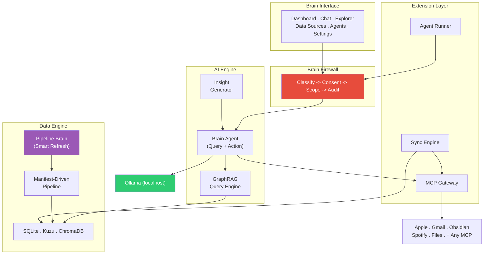

# SecBrain

[](LICENSE)
[]()
[]()
[]()

**Privacy-first AI assistant that runs on your machine and automatically aggregates your personal data without exposing it to AI providers.**

Your whole life, in a closed loop — SecBrain ingest every source, connecting it by what matters, and handing you only what's relevant, when it's relevant.

---

Most AI assistants know nothing about you. They start every conversation from zero. SecBrain changes that. It's a privacy-first personal operating system that runs entirely on your machine — understanding, aggregating and organizing your calendar, contacts, messages, notes, health data, and more into a knowledge engine (internal data warehouse, graph database and vector database) that a local LLM uses to understand your life and give you genuinely personalized actions and answers.

Toggle on your data sources like you toggle on WiFi. Ask questions grounded in your actual data. Let the AI schedule meetings, send messages, and take actions on your behalf — with your explicit confirmation every time. Third-party agents generate insights you never thought to ask for, while a Rust firewall ensures every byte of data is classified, consented, scoped, and audited.

**Your data never leaves your machine. No cloud APIs, no telemetry, no accounts.**

## Building from source

SecBrain ships as source code. Clone, build, run.

### Prerequisites

- macOS, Linux, or Windows (macOS recommended, Apple Silicon ideal)
- Rust 1.75+ ([rustup.rs](https://rustup.rs/))
- Node.js 20+ & npm ([nodejs.org](https://nodejs.org/)) — the repo ships a `.tool-versions` so [asdf](https://asdf-vm.com/)/[mise](https://mise.jdx.dev/) users get the right version automatically. Node < 18 fails with `crypto.getRandomValues is not a function`.
- Python 3.10+ ([python.org](https://www.python.org/downloads/))
- [Ollama](https://ollama.ai) (for local inference)

### Hardware requirements

> [!IMPORTANT]
> SecBrain runs the LLM **entirely on your machine**. The default model is
> **`llama3.1:70b`** because it's the smallest model that delivers acceptable
> results — and it is demanding. **We strongly recommend installing on a machine
> that meets the minimum specs below.**
>
> | | Spec |
> |---|---|
> | **Recommended** | Apple Silicon **M2/M3 Ultra** · **64–128 GB** unified RAM · **1–2 TB** SSD (or a GPU with ≥48 GB VRAM) |
> | **Minimum** | ~48 GB RAM/VRAM free for the model weights |
>
> ⚠️ **On under-spec machines the default `llama3.1:70b` can exhaust memory and
> make the whole OS unresponsive (freeze/beachball).** You can pick a lighter
> model in the install wizard or under **Settings → AI Model**, but **we cannot
> guarantee acceptable results below `llama3.1:70b`.**

### Build & run

```bash
git clone https://github.com/vdittgen/secbrain.git
cd secbrain

# Python environment
python -m venv .venv && source .venv/bin/activate
pip install -e ".[dev]"

# Node dependencies
npm install

# Fetch the bundled Python runtime (one-time; detects your OS/arch)
./scripts/fetch-python-runtime.sh

# Pull local AI models
# llama3.1:70b is the recommended default (~43 GB download; see Hardware
# requirements). On a less capable machine, swap it for a smaller model
# (e.g. gemma4:e2b) — results are not guaranteed below 70b.
ollama pull llama3.1:70b
ollama pull nomic-embed-text

# Initialize databases
python -m src.core.cli init

# Start the app
cargo tauri dev       # development mode
cargo tauri build     # production binary
```

On first launch, the onboarding wizard walks you through connecting your data sources. Calendar and Contacts are pre-selected — within 60 seconds you'll have real data on your dashboard.

## Three Pillars

### Data Engine

Connects to your life data through the MCP protocol — the same open standard used by Claude, Cursor, and the broader AI ecosystem. Calendar events, contacts, messages, notes, health metrics, files, and more flow through a professional-grade data pipeline (staging -> intermediate -> marts) with emotional labeling, relationship graphing, and semantic search. Three embedded databases work together: SQLite for structured storage, Kuzu graph db for entity relationships, and ChromaDB vector db for natural language retrieval.

### Trust Layer

When AI agents act on your behalf, the Brain Firewall (written in Rust) ensures they only see what they need, only do what you approve, and every decision is audited. Every data field is classified into three sensitivity tiers — public, personal, sensitive. Tier 1 is auto-approved. Tier 2 checks cached consent. Tier 3 prompts you every single time. All actions require explicit confirmation. The audit trail uses SHA-256 hash chaining — tamper with any entry and the chain breaks.

### Extension System

15 pre-verified connectors ship with the app, from Apple Calendar to Spotify. Toggle them on with one tap. For anything else, paste any MCP server command and the system auto-discovers its capabilities, maps fields, assigns sensitivity tiers, and starts syncing — no YAML, no config files. Third-party agents run sandboxed: they access data through the Firewall, write to their own namespaced tables, and call only the local LLM.

## Architecture



See [docs/ARCHITECTURE.md](docs/ARCHITECTURE.md) for the full system design.

## Tech Stack

| Component | Technology | Purpose |
|-----------|-----------|---------|
| App Shell | Tauri 2 | Native desktop app (Rust + webview) |
| Frontend | React 18 + Tailwind | Dashboard, chat, data explorer, data sources |
| Security | Rust | Brain Firewall, consent, audit trail, scope enforcement |
| Structured DB | SQLite | Embedded SQL — raw tables, pipeline, query tracking (WAL mode) |
| Knowledge Graph | Kuzu | Entity relationships and multi-hop traversals |
| Vector Search | ChromaDB | Semantic similarity with Ollama embeddings |
| Data Pipeline | Manifest-driven Python | ELT with staging, intermediate, marts + smart refresh |
| Local LLM | Ollama | On-device inference (gemma4:e2b) — zero cloud calls |
| Connectors | MCP Protocol | Universal data source protocol (15 pre-verified + any custom) |

## Contributing

We welcome contributions! See [CONTRIBUTING.md](CONTRIBUTING.md) for dev environment setup, code style guidelines, and the sensitivity tier rule.

## License

Apache-2.0 — see [LICENSE](LICENSE) for details.

---

Built by **Newton Data Intelligence**
