# Arandu — Architecture

This document describes the system architecture, data flow, extension system, security model, intelligent pipeline, and database roles in Arandu.

## System Overview

Arandu is a five-layer system: data sources connected via MCP protocol, three embedded databases for storage, a Python core for data processing and AI, a Rust-based security firewall, and a native macOS interface.

```mermaid
graph TB
    subgraph "Layer 5: Brain Interface"
        UI["React + Tailwind<br/>(Dashboard, Chat, Explorer,<br/>Data Sources, Agents, Settings)"]
        TAURI["Tauri IPC<br/>(Async Commands)"]
    end

    subgraph "Layer 4: Privacy Firewalls"
        INJ["Injection Firewall<br/>(Python, prompt-injection guard)"]
        EGRESS["Egress Firewall<br/>(Python, tier classifier + route picker)"]
        REGISTRY["Placeholder Registry<br/>(Python, Tier 2/3 PII swap)"]
        AUDIT["Audit Chain<br/>(SHA-256, ~/.arandu/data/audit.jsonl)"]
    end

    subgraph "Layer 3: AI Engine"
        BA["Brain Agent<br/>(Query + Action modes)"]
        QE["Query Engine<br/>(Hybrid GraphRAG)"]
        TR["Tool Registry<br/>(MCP Actions)"]
        IG["Insight Generator"]
        SD["Schema Discovery Agent"]
        LAB["Emotional Labeler"]
    end

    subgraph "Layer 2: Data Engine"
        DL["Data Layer (Facade)"]
        DUCK["SQLite<br/>(Structured SQL)"]
        KUZU["Kuzu<br/>(Knowledge Graph)"]
        CHROMA["ChromaDB<br/>(Vector Search)"]
        SM["Manifest-Driven Pipeline"]
        PB["Pipeline Brain<br/>(Smart Refresh)"]
        QT["Query Tracker<br/>(Interest Profiler)"]
    end

    subgraph "Layer 1: Extension Layer"
        MCPGW["MCP Gateway"]
        SE["Sync Engine"]
        CAT["Connector Catalog<br/>(8 pre-verified)"]
        ADAPT["Ingestion Adapters"]
        AR["Agent Runner<br/>(Sandboxed)"]
        SKILLS["Skill Registry"]
    end

    EXT_APPLE["🍎 Apple MCP<br/>(Calendar, Contacts,<br/>Notes, Mail, Health)"]
    EXT_OTHER["📧 Gmail · 📝 Obsidian<br/>🎵 Spotify · 📂 Files<br/>💬 WhatsApp · + Any MCP"]
    LLM["LLM Provider<br/>(Ollama, local)"]

    UI -->|IPC| TAURI
    TAURI --> FW
    FW --> CLASSIFY
    FW --> CONSENT
    FW --> SCOPE
    FW --> AUDIT
    TAURI -->|Subprocess| BA
    BA --> QE
    BA --> TR
    BA --> LLM
    QE --> DUCK
    QE --> KUZU
    QE --> CHROMA
    TR --> MCPGW
    IG --> BA
    IG --> QT
    SD --> LLM
    LAB --> LLM
    PB --> QT
    PB --> SM
    SM --> DUCK
    SE --> ADAPT
    ADAPT --> DUCK
    SE --> MCPGW
    MCPGW --> EXT_APPLE
    MCPGW --> EXT_OTHER
    AR --> FW
    AR --> SKILLS

    style FW fill:#e74c3c,color:#fff
    style AUDIT fill:#e74c3c,color:#fff
    style LLM fill:#2ecc71,color:#fff
    style PB fill:#9b59b6,color:#fff
    style SE fill:#3498db,color:#fff
```



## The Five Layers

### Layer 1 — Extension Layer (MCP Protocol)

Data sources connect via the Model Context Protocol. The system ships with 8 pre-verified connectors that users toggle on with one tap. Mac connectors (Apple suite, filesystem, WhatsApp) sync via direct native function calls without MCP subprocesses. Power users can install any MCP-compatible server.

**MCP Gateway** manages MCP server processes (start, stop, health checks, auto-restart). It discovers available tools via the standard `tools/list` protocol call and classifies them as DATA tools (provide data to ingest) or ACTION tools (perform side effects like sending messages or creating events).

**Sync Engine** coordinates periodic data syncing. Each enabled connector gets one or more Ingestion Adapters — one per data tool. On each scheduled sync: the adapter calls the MCP tool, transforms the response using pre-verified field mappings, deduplicates against existing rows, and upserts into the target SQLite raw table. After any sync that produces new or changed rows, the engine marks the pipeline as stale.

**Connector Catalog** contains 8 pre-verified connector templates bundled with the app, organized by category (Apple, Files, Lifestyle). Each template includes field mappings, sensitivity tier assignments, dedup keys, and sync schedule. Native connectors (Apple suite, filesystem, WhatsApp) call Python functions directly instead of spawning MCP subprocesses. No AI discovery is needed for standard connectors.

**Agent Runner** executes third-party agents in isolated subprocesses. Agents can only access data through the Firewall (via `AgentContext.query()`), can only write to their own namespaced tables (`ext_{agent_id}_*`), and can only call the configured LLM provider (no arbitrary network access by default). Resource limits (memory, CPU time) are enforced per agent.

**Skill Registry** holds stateless, shared capabilities that agents can call: text summarization, emotion classification, entity extraction, sensitivity classification. Skills have no data access of their own.

### Layer 2 — Data Engine (SQLite + Kuzu + ChromaDB)

Three embedded databases serve distinct query patterns. SQLite handles structured SQL storage, Kuzu handles entity-relationship graph traversals, and ChromaDB handles semantic vector search. The Query Engine combines all three for hybrid GraphRAG retrieval.

**Manifest-Driven Pipeline** transforms raw data through staging (clean, type-cast, annotate sensitivity tiers), intermediate (join, enrich, label emotions), and mart (domain-specific query-ready views) layers. The pipeline is defined via `pipeline_manifest.json` and executed by a Python-based executor (`src/pipeline/executor.py`). Every column in every model carries a sensitivity tier annotation.

**Pipeline Brain** decides which models to build on each refresh cycle based on user interest and data freshness. It consults the Query Tracker for the user's interest profile and only builds models for active domains. Dashboard models always run. Low-interest domains get only staging (cheap). Domains with zero queries in two weeks get skipped entirely.

**Query Tracker** logs every question the user asks, classifies it by domain (calendar, health, work, social, etc.), and maintains a weighted interest profile. This profile drives the Pipeline Brain's decisions, triggers on-demand mart generation when interest in a new domain crosses a threshold, and feeds the Insight Generator.

### Layer 3 — AI Engine (LLM Provider)

All AI components use the `LLMProvider` abstraction (`src/models/llm_provider.py`). Arandu ships **Ollama** (local) as the only provider — there are no cloud/remote provider classes in the codebase. The user selects which local model to use in Settings. Ollama is auto-started on app launch. Embeddings use Ollama's `nomic-embed-text`.

**Brain Agent** operates in two modes. In Query Mode, it uses the hybrid GraphRAG Query Engine to assemble personal context from all three databases, then calls the configured LLM provider to generate an answer with source attribution. In Action Mode, it classifies user intent, selects the appropriate MCP action tool, extracts parameters from natural language, and presents a confirmation card before executing.

**Tool Registry** maintains a live inventory of all callable MCP action tools from enabled connectors. When the Brain Agent detects an action intent ("schedule a meeting", "send a message"), it consults the Tool Registry, selects the best tool, and routes execution through the Firewall.

**Insight Generator** runs every 4 hours (and on app launch). It analyzes the user's most frequent question patterns and generates proactive insights via the configured LLM provider: pre-answering common questions, detecting cross-domain correlations (e.g., sleep quality vs. meeting density), and surfacing relationship maintenance reminders.

**Schema Discovery Agent** (for custom connectors only) analyzes MCP server output using a two-pass approach. Pass 1 uses rule-based keyword matching for field types and sensitivity classification. Pass 2 calls the configured LLM provider only when Pass 1 has low confidence, to determine semantic meaning and suggest table mappings. Always conservative: uncertain sensitivity defaults to the higher tier.

### Layer 4 — Privacy Firewalls

Privacy enforcement is split across Python (the live runtime) and Rust (the audit chain reader). There is no per-call consent dialog: the user picks a privacy mode once at onboarding (remote-default vs local-only) and the firewalls enforce that contract automatically thereafter. See `docs/PRIVACY.md` for the full model.

**Injection Firewall** (`src/agents/firewall/injection_firewall.py`) inspects inbound prompts for injection attempts and either blocks them or strips the offending segment before the request reaches the model.

**Egress Firewall** (`src/agents/firewall/egress_firewall.py`) computes the maximum sensitivity tier across keyword floor, agent manifest, and (in local-only mode) an LLM classifier. It then decides the route (`remote` / `local`) and whether redaction is required. `requires_consent` is always false — captured during onboarding, not per call.

**Placeholder Registry** (`src/models/redaction_registry.py`) is the privacy chokepoint. Under remote-default, every Tier 2/3 PII value (names, emails, phones, dates, money) is swapped for a stable placeholder (`<PERSON_3>`, `<EMAIL_2>`) before the prompt leaves the device. Responses are rehydrated locally. Raw values never reach the remote provider.

**Audit Chain** is a SHA-256 hash-chained JSONL file at `~/.arandu/data/audit.jsonl`. Python writes every firewall decision (`egress_decision`, `egress_redaction`, `local_inference_toggle`); Rust (`src-tauri/src/firewall/audit.rs`) reads and verifies it for the Audit Log page. Append-only, no delete API; `verify_chain()` confirms tamper-evidence on demand.

### Layer 5 — Brain Interface (Tauri + React)

**Dashboard** shows today's schedule, recent activity, quick stats, and a coaching phrase generated by the Brain Agent. Proactive insights appear below the greeting. Each widget carries a freshness indicator showing when data was last processed and whether new data is pending.

**Chat** supports both queries and actions. Responses show source attribution with sensitivity tier badges. Action confirmations display a preview card with Confirm/Cancel buttons. Streaming responses provide token-by-token rendering.

**Data Sources** is the primary way users connect data. Standard connectors appear as toggles organized by category. Each toggle handles requirements inline (macOS permission dialogs, OAuth flows, environment variable inputs). An "Add custom connector" section at the bottom serves power users.

**Data Explorer** provides tabular views of all marts with sensitivity tier filtering. Tier 3 values display as "[Protected]" unless explicitly unlocked.

**Agents** page shows installed agents, their run history, resource usage, and audit logs. Includes the Extensions management interface.

## Data Flow

### Complete Path: MCP Source → Dashboard

```
MCP Server (e.g., Apple Calendar)
    │
    │  MCP Gateway calls tools/list, then list_calendar_events
    ▼
Sync Engine → Ingestion Adapter
    │  Transform: rename fields, cast types, assign sensitivity tiers
    │  Dedup: compare against existing rows by dedup_key
    ▼
SQLite Raw Table (raw_calendar_events)
    │
    │  Pipeline Brain checks: "Is calendar a high-interest domain?"
    │  Yes → include in refresh plan
    ▼
Manifest-Driven Pipeline (selective execution)
    │  stg_calendar_events → int_events_enriched → mart_today
    ▼
ChromaDB Re-Index (incremental)
    │  New/changed mart records get embedded
    ▼
Dashboard renders mart_today data
Chat can answer "What meetings do I have today?"
```

### Complete Path: Chat Action → MCP Tool Call

```
User: "Schedule a meeting with Sarah tomorrow at 3pm"
    │
    ▼
Brain Agent: classify_intent() → "action"
    │
    ▼
Brain Agent: select_tool() → "apple-calendar:create_event"
    │  Extract params: { title: "Meeting with Sarah", start: "2026-02-27T15:00" }
    ▼
Firewall: evaluate_action()
    │  Check: does user allow calendar writes? (Tier 2)
    ▼
UI: Action confirmation card
    │  "Create event: Meeting with Sarah, Feb 27 at 3:00 PM"
    │  [Cancel] [Confirm ✓]
    ▼
User confirms → MCP Gateway calls create_event on Apple Calendar MCP
    │
    ▼
Sync Engine: immediate re-sync for this connector
    │  New event appears in raw_calendar_events
    ▼
Audit Log: records the action (agent_id, tool, params, decision, timestamp)
```

### Intelligent Pipeline: Interest-Driven Refresh

```
Query Tracker maintains weighted interest profile:
    calendar: 8.0 (47 questions/week)
    work:     7.0 (23 questions/week)
    health:   3.5 (5 questions/week)
    music:    0.3 (0 questions/week)

Pipeline Brain generates RefreshPlan:
    CRITICAL: mart_today, int_daily_summary     (dashboard dependency)
    HIGH:     stg_calendar_events, mart_work    (top interest + new data)
    MEDIUM:   stg_health_metrics                (recent interest + new data)
    LOW:      stg_messages                      (new data, staging only)
    SKIP:     mart_music, stg_files             (no queries, no new data)

Result: ~8 sec vs ~22 sec for full pipeline. 63% faster.

On-demand mart creation:
    music interest rises from 0.3 → 4.0 (user starts asking about music)
    → Pipeline Brain detects: weight > 3.0, no mart exists, 50+ raw rows
    → Model Generator creates mart_music optimized for user's top questions
    → Human reviews and approves generated SQL
    → mart_music runs on future refresh cycles
    → Interest decays if user stops asking → mart gets skipped again
```

### ChromaDB Indexing

Runs after each successful pipeline execution. Indexes changed mart records into domain-specific collections:

```
Pipeline completes → Indexer processes changed records
    │
    ├── personal (notes, journals, personal messages)
    ├── work (work messages, meetings, tasks)
    ├── health (health data, doctor notes)
    ├── social (friend messages, events)
    └── ideas (project ideas, learning)

Each document carries metadata:
    source_table, record_id, timestamp, sensitivity_tier, domain
```

### Kuzu Knowledge Graph

The graph database captures entity relationships:

```
Node Types: Person, Event, Place, Emotion, Idea, Topic

Relationship Types:
    Person -[KNOWS]-> Person
    Person -[PARTICIPATED_IN]-> Event
    Person -[SENT]-> Message
    Person -[FEELS]-> Emotion
    Event  -[LOCATED_AT]-> Place
    Idea   -[RELATED_TO]-> Topic

All edges carry: weight, timestamp, sensitivity_tier
```

Graph extensions are auto-generated when new connectors bring entity data. For example, enabling Spotify creates `Track` nodes and `LISTENED_TO` edges.

## Security Model

### Sensitivity Tiers

Every column in every table is classified:

| Tier | Level | Examples | Agent Access |
|------|-------|----------|--------------|
| 1 | Public | Preferences, categories, file names, event titles | Pass-through to remote |
| 2 | Personal | Names, routines, schedules, contact info, locations | Auto-redacted via placeholder registry before remote egress |
| 3 | Sensitive | Health metrics, finances, emotions, traumas, message body | Auto-redacted; raw values never leave the device |

**Enforcement at every layer:**

1. **Connector Catalog** — Every field mapping includes a pre-assigned tier
2. **Schema Discovery** — AI assigns tiers to custom connector fields (conservative defaults)
3. **Pipeline models** — Every column annotated with tier in model SQL
4. **SQLite queries** — `WHERE sensitivity_tier <= ?` on all data retrieval
5. **Kuzu traversals** — `WHERE r.sensitivity_tier <= $max_tier` on all edge queries
6. **ChromaDB searches** — `{"sensitivity_tier": {"$lte": max_tier}}` metadata filter
7. **Firewall** — Egress firewall classifies the prompt and redacts Tier 2/3 PII via the placeholder registry before remote egress
8. **Agent sandbox** — Agents can only access fields declared in their manifest scope

### Request Lifecycle (LLM call)

```
Agent calls chat_via_firewalls(messages)
    │
    ▼
INJECTION FIREWALL: scan messages, block/strip injection attempts
    │
    ▼
EGRESS CLASSIFY: max tier across keyword floor, agent manifest, (local-only) LLM classifier
    │
    ▼
ROUTE DECISION:
    │  local-only mode → route="local", no redaction (Ollama keeps raw values on-device)
    │  remote-default + Tier 1 → route="remote", no redaction
    │  remote-default + Tier 2/3 → route="remote", redaction required
    ▼
REDACT (if required): swap PII for placeholders via persistent registry
    │
    ▼
PROVIDER CALL: Ollama (local)
    │
    ▼
REHYDRATE: locally replace placeholders in the response
    │
    ▼
AUDIT: append `egress_decision` and (if redacted) `egress_redaction` to audit.jsonl
```

### Request Lifecycle (Action Execution)

```
Brain Agent selects MCP action tool
    │
    ▼
CLASSIFY: What tier is this action? (calendar writes = Tier 2)
    │
    ▼
CONFIRM: ALL actions require explicit user confirmation (v1)
    │      UI shows preview card: what will happen, with Confirm/Cancel
    ▼
EXECUTE: MCP Gateway calls the tool on the MCP server
    │
    ▼
AUDIT: Record action attempt, parameters, decision, and result
    │
    ▼
RE-SYNC: Trigger immediate sync for the affected connector
```

### Agent Sandbox Constraints

Third-party agents operate under strict isolation:

- **Data access:** Only through Firewall API (`AgentContext.query()`), never direct DB access
- **Write scope:** Only to `ext_{agent_id}_*` namespaced tables
- **Network:** Disabled by default. Must be declared and approved.
- **LLM access:** Uses the app's configured local LLM provider (Ollama in Arandu). No arbitrary external API calls.
- **Resources:** Max memory and CPU time enforced per agent from manifest
- **Model creation:** Can propose new pipeline models, but human must approve before deployment
- **Cross-agent data:** Not accessible unless explicit dependency declared

### Audit Trail Integrity

```
Entry 1:  previous_hash = "0000...0000" (genesis)
          hash(entry_1) = "aabb...ccdd"

Entry 2:  previous_hash = "aabb...ccdd"
          hash(entry_2) = "eeff...1122"

Entry 3:  previous_hash = "eeff...1122"
          hash(entry_3) = "3344...5566"
```

`verify_chain()` walks the entire log and confirms each `previous_hash` matches the SHA-256 of the preceding entry. Any modification breaks the chain.

Properties: append-only file access, no delete API, tamper-evident hash chain, verifiable at any time.

## Extension System

### Three Extension Types

| Type | Purpose | Data Direction | Example |
|------|---------|----------------|---------|
| MCP Connector | Bring external data into Arandu | Inward (sync data) | Apple Calendar, Gmail, Spotify |
| Agent | Process data and generate insights | Both (read marts, write to own tables) | Weekly Digest, Relationship Tracker |
| Skill | Shared stateless capability | None (called by agents) | Summarize Text, Classify Emotion |

### Standard Connectors (Toggle On)

Shipped with the app, pre-verified, zero configuration:

| Category | Connectors | Requirements |
|----------|-----------|-------------|
| 🍎 Apple | Calendar, Contacts, Notes, Mail, Messages | macOS permissions |
| 📂 Files | Documents & Desktop | None |
| 💬 Messaging | WhatsApp | WhatsApp Web |
| 🎵 Lifestyle | Spotify | OAuth |

### Custom Connectors (Advanced)

For any MCP-compatible server not in the catalog:

1. User pastes the MCP command (e.g., `npx my-custom-mcp-server`)
2. System launches server, calls `tools/list` (standard MCP protocol)
3. Sample Data Probe calls each data tool with minimal params
4. Schema Discovery Agent analyzes fields (rules first, LLM if needed)
5. User sees one-screen preview with proposed field mappings and sensitivity tiers
6. User clicks Connect — system generates all internal config and starts syncing

### On-Demand Pipeline Models

When user interest in a new data domain crosses a threshold and enough raw data exists, the Model Generator creates optimized pipeline models:

1. Pipeline Brain detects: domain weight > 3.0, no mart exists, 50+ raw rows
2. Model Generator receives the user's top questions for that domain
3. Generates staging + mart SQL optimized to answer those specific questions
4. Generated models are namespaced (`ext_{connector_id}_*`) and sandboxed
5. Human reviews the SQL with syntax highlighting and plain-English explanation
6. On approval, models join the pipeline refresh cycle
7. On interest decay, Pipeline Brain skips the mart (saves CPU)

## Database Roles

### SQLite (Structured SQL)

**Purpose:** Primary structured data store. All raw ingested data, all pipeline transformation outputs, query tracking, pipeline stats, and insight storage. Uses WAL mode with 30s busy timeout and LRU query cache.

**Location:** `~/.arandu/data/arandu.sqlite3`

**Core tables:**
- `raw_*` — One per data source (raw_calendar_events, raw_contacts, raw_messages, raw_emails, raw_notes, raw_health_metrics, raw_files, raw_reminders, raw_workouts, raw_listening_history, raw_voice_memos)
- `stg_*`, `int_*`, `mart_*` — Pipeline transformation outputs
- `ext_*` — Agent-namespaced tables (ext_weekly_digest_summaries, etc.)
- `_query_log` — Every user question with domain classification
- `_interest_profile` — Weighted user interest per domain
- `_insights` — Generated proactive insights with feedback tracking

**Why SQLite:** Embedded (no server), built into Python stdlib, WAL mode for concurrent reads, lightweight and fast for the structured workload, universal tooling support.

### Kuzu (Knowledge Graph)

**Purpose:** Entity relationship store. Captures how people, events, places, and concepts connect. Enables graph traversals that find context vector search would miss.

**Location:** `~/.arandu/data/kuzu_db/`

**Node types:** Person, Event, Place, Emotion, Idea, Topic (extensible when new connectors bring entity data)

**Edge types:** KNOWS, PARTICIPATED_IN, SENT, FEELS, LOCATED_AT, RELATED_TO, MENTIONED_IN, TAGGED_WITH — each carrying `weight`, `timestamp`, `sensitivity_tier`

**Why Kuzu:** Embedded (no server), Cypher query language, optimized for multi-hop traversals, supports property graphs with typed edges.

### ChromaDB (Vector Search)

**Purpose:** Semantic similarity search. Stores embeddings of mart records for natural language retrieval.

**Location:** `~/.arandu/data/chromadb/`

**Collections:** personal, work, health, social, ideas — organized by life domain

**Embedding model:** Ollama `nomic-embed-text` (fallback: ChromaDB built-in `all-MiniLM-L6-v2`)

**Why ChromaDB:** Embedded (no server), metadata filtering (sensitivity tiers), Python-native, supports custom embedding functions.

## IPC Commands

| Command | Args | Tier | Purpose |
|---------|------|------|---------|
| `get_database_stats` | — | 1 | Health check and row/node/doc counts |
| `get_today_summary` | — | 2 | Today's events, messages, insights |
| `get_recent_messages` | `limit`, `offset` | 2 | Paginated recent messages |
| `get_upcoming_events` | `days`, `limit` | 2 | Calendar events |
| `ask_brain` | `question` | 2–3 | Query or action via Brain Agent (streamed) |
| `confirm_action` | `tool_id`, `params` | 2 | Execute a confirmed MCP action |
| `get_chat_history` | — | 3 | Session chat messages |
| `get_connector_catalog` | — | 1 | All connectors with status |
| `toggle_connector` | `id`, `enabled`, `inputs` | 1 | Enable/disable a data source |
| `sync_connector_now` | `id` | 1 | Trigger immediate sync |
| `get_pipeline_status` | — | 1 | Last run, staleness, pending changes, ETA |
| `trigger_pipeline_run` | — | 1 | Start smart refresh (background) |
| `get_audit_log` | `limit`, `offset`, `filter` | 1 | Paginated firewall decisions |
| `get_extensions` | — | 1 | Installed agents, skills, custom connectors |
| `run_agent` | `id` | 1 | Trigger an agent run |
| `install_extension_discover` | `command`, `args` | 1 | Auto-discover custom MCP server |
| `install_extension_confirm` | `preview`, `overrides` | 1 | Confirm custom connector install |
| `get_settings` | — | 1 | Current app settings including interests |
| `update_settings` | `settings` | 1 | Persist settings |

## Key Design Decisions

1. **Fully local** — All AI uses the local Ollama server. User data never leaves the machine. Network access for extensions is separately opt-in and declared.

2. **Rust for security, Python for ML** — The audit chain (read + verify) is in Rust for memory safety. The privacy firewalls (injection, egress, placeholder registry) live in Python alongside the agent runtime they enforce.

3. **Three databases, not one** — Each serves a distinct query pattern: SQLite for structured SQL, Kuzu for graph traversals, ChromaDB for vector similarity. The Query Engine combines all three for hybrid GraphRAG.

4. **MCP as universal connector protocol** — Rather than building custom integrations, the system uses the open MCP standard. Any MCP-compatible server works. Standard connectors ship pre-verified; custom connectors are auto-discovered.

5. **Toggle-first UX** — Standard connectors require one tap, not commands or config files. Requirements (permissions, OAuth, env vars) are handled inline. The "paste a command" flow is reserved for power users.

6. **Interest-driven pipeline** — Not every model runs every refresh. The Pipeline Brain learns what the user cares about and allocates compute accordingly. This keeps the app responsive on constrained hardware.

7. **AI-assisted but human-approved** — Schema discovery, field mapping, sensitivity classification, and pipeline model generation are AI-assisted. But no generated model goes live without human approval.

8. **Fail-safe defaults** — Unknown fields default to Tier 3 (redacted in remote-default). All MCP actions require confirmation. Audit chain tampering is detected by `verify_chain()`.

9. **Namespace isolation** — Extensions can only create tables prefixed with `ext_{id}_`. They cannot modify core pipeline models. Generated models are sandboxed. This prevents any extension from corrupting the core data layer.

10. **Subprocess bridge** — Tauri calls Python via subprocess rather than FFI, keeping languages cleanly separated and individually testable. The pipeline runs as a separate process with lower CPU priority to avoid blocking the UI.
